# Algoritmos-em-Grafos

Este material foi desenvolvido para dar suporte aos alunos da disciplina de Algoritmos em Grafos. Nesses repositórios, serão disponibilizados tutoriais e material teórico para o ensino de algoritmos em grafos na linguagem python. Os conceitos podem ser usados para o desenvolvimento em outras liguagens, mas por uma questão de facilidade e praticidade que a linguagem Python possui, o presente material terá exemplos em Python.

## Tópicos a se abordar
* Bibliotecas em python como matplotlib e networkX;  
* Estruturas de dados;  
* Métodos de busca em grafos;  
* Árvores geradoras mínimas;  
* Caminho mínimo;  
* Circuitos hamiltoniano e Euleriano;  
* Coloração de grafos;  
* Fluxo Máximo.
## O que é necessário para acompanhar o material:
* Sistema operacional: Windows ou Linux;  
* Jupyter;  
* Conhecimento básico para utilizar o github;  
* Python 3x (Preferencialmente >=3.7).  
## Instalação do Git
### Windows
Para instalar o git no windows faça o download do instalador de 32 ou 64 bits:

[Link do instalador do git](https://git-scm.com/download/win)


### Linux
Para distribuição Fedora:

```
sudo yum install git-all
```

Para Debian e distribuições baseadas em Debian como Ubuntu e derivados:

``` 
sudo apt-get install git-all
``` 

Arch Linux:

``` 
sudo pacman -$ git
``` 

## Download do repositório
Escolha o diretório que deseja baixar o repositório e insira o comando abaixo no terminal.

```
git clone https://github.com/isabelamn07/GCC218-Algoritmos-em-grafos.git
```
## Instalação do Python 
###  Windows 
1. Entre no site [www.python.org](https://www.python.org/)
2. Escolha a opção no Downloads no menu e escolha uma das versões do python 3


3. Você pode escolher alguma release mais antiga


4. Ou a versão mais nova

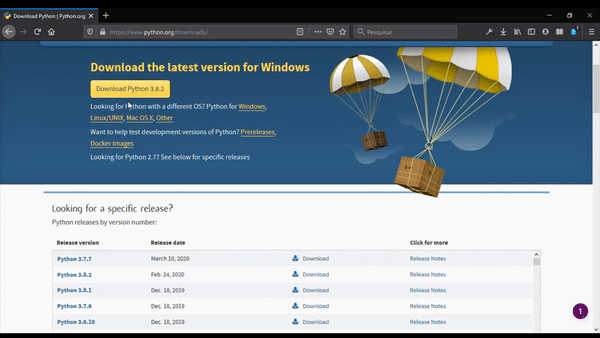

5. Ao fazer a instalação não se esqueça de adicionar o python no PATH do Windows

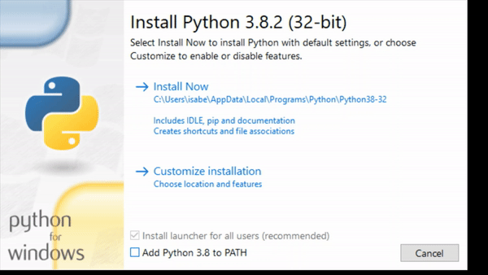


### Linux
### 1. Verificar instalação 
Na maioria das distribuições Linux o python já vem instalado

1. Para verificar se o Python já está instalado:


2. Python 3:

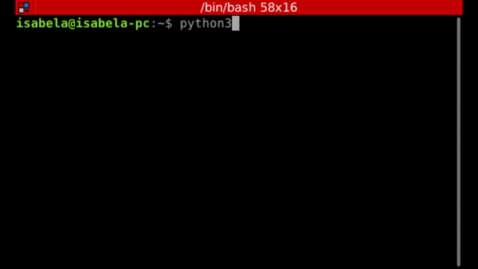


### 2. Instalar 
Existem diversas formas de se instalar o python e suas diversas versões no Linux, aqui apenas alguns exemplos.

### 2.1. Através de download

2.1.1. Escolha uma versão para download [Link downloads python](https://www.python.org/downloads/)
 

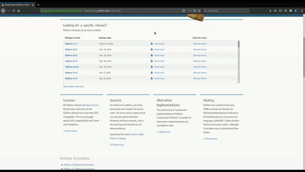

2.1.2. Extraia o arquivo compactado
``` 
tar -xf Python-3.x.x.tar.xz
```

2.1.3. Entre no diretório

```
cd Python-3.x.x
```

2.1.4. Instale
```
./configure --enable-optimizations
```
```
sudo make install 
```


#### 2.2. Apenas através do terminal

2.2.1. Para Debian e derivados:
```
sudo apt install python3.x
``` 

2.2.2 Para RHEL/CentOS 7/6 & Fedora 31/30

``` 
sudo yum install gcc openssl-devel bzip2-devel libffi-devel
``` 

``` 
wget https://www.python.org/ftp/python/3.8.2/Python-3.8.2.tgz
``` 

``` 
tar xzf Python-3.8.2.tgz
``` 

``` 
cd Python-3.8.2
``` 

``` 
sudo ./configure --enable-optimizations
``` 

``` 
sudo make altinstall
``` 

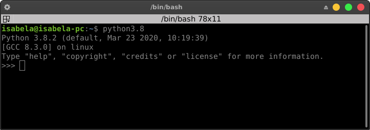
### 3. Pip
Em alguns casos é necessário instalar o pip (package manager for Python - gerenciador de pacotes para Python)

3.1. Debian/Ubuntu

```
sudo apt install python-pip
``` 
ou

```
sudo apt install python3-pip
``` 

3.2. CentOS/RHEL
``` 
sudo yum epel-release
``` 

``` 
sudo yum install python-pip
``` 

3.3. Fedora
```
sudo dnf install python-pip 
```
ou
```
sudo dnf install python3-pip 
```
3.4. Arch Linux

```
pacman -S python-pip
```

## Instalação Jupyter Notebook
É essencial utilizar o Jupyter notebook para melhor organização e visualização do material. Todo o conteúdo será separado e enumerado para manter a ordem, e para deixar mais fácil encontrar os tópicos. Existe um sumário com a estrutura dos tópicos abordados.

### Windows
### Via terminal
```
pip install jupyter
```

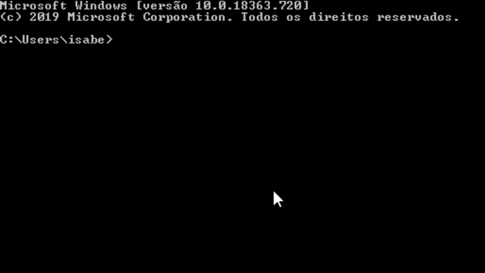

### Usando Anaconda
1. Baixe o instalador [Instalador anaconda](https://www.anaconda.com/distribution/#download-section)
2. Escolha o instalador com a versão python 3.x.x:

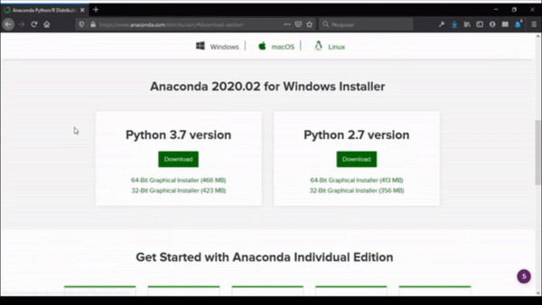


### Linux:
### Via Terminal
```
pip install notebook
```
```
pip3 install notebook
```
ou
```
sudo apt install jupyter-notebook
```

ou 
```
conda install -c conda-forge notebook
```

### Usando Ananconda
No Linux, é possível o Jupyter através do terminal ou fazendo o download de um pacote utilizando o software Anaconda [Link para o instalador](https://www.anaconda.com/download/#linux)

Instale a versão Anaconda com a versão 3.x do Python
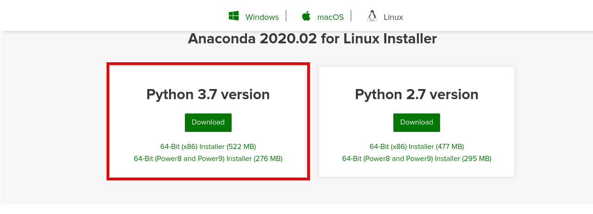

1. Conceda permissão para que o script seja executável

``` 
chmod 777 Anaconda3-x.x-Linux-x86_64.sh
``` 
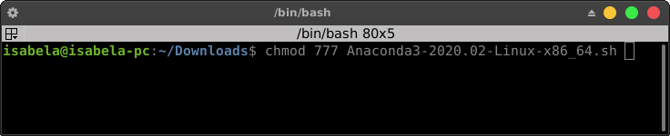

2. Execute o arquivo .sh
``` 
./Anaconda3-x.x-Linux-x86_64.sh
``` 


3. Proceda com a instalação aceitando o termo de licença

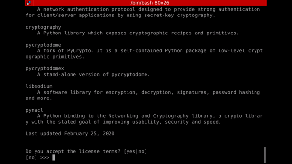

4. Escolha um diretório para instalação 

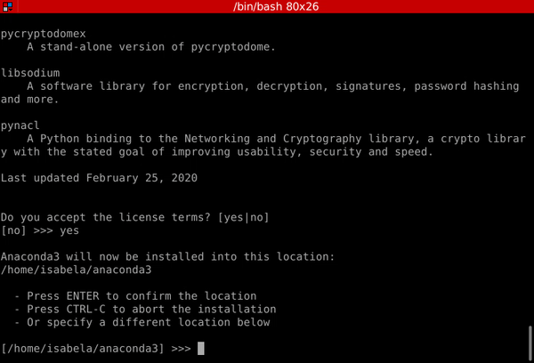

5. Ao terminar a instalação recuse a execução do conda init

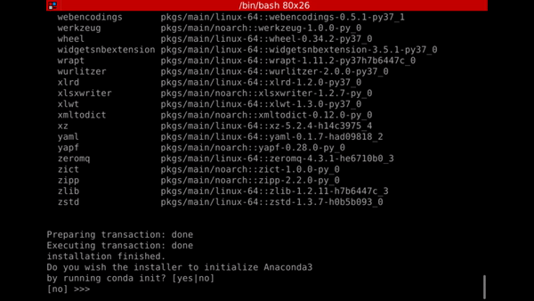

6. Então execute os seguintes comandos:

```
conda config --set auto_activate_base false
```
```
conda init
```

## Utilizando o Jupyter notebook
### Windows
### Via terminal
```
jupyter notebook
```


### Com Anaconda


### Linux
### Via terminal
```
jupyter notebook
```

ou 

``` 
jupyter-notebook
``` 


       
